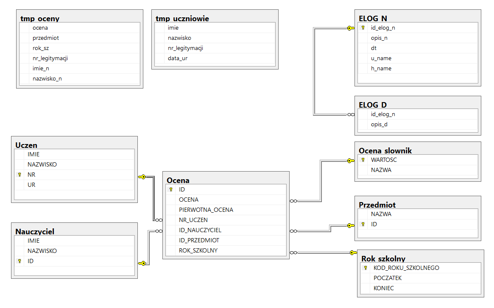

# Data Integration Project with MS SQL and MS Business Intelligence

## Project Description

This project focuses on integrating data from text files into an MS SQL database using the SSIS (SQL Server Integration Services) package, which facilitates rapid data loading and SQL script execution. The aim of the project was to create an application for automatic generation of JSON documents, which can be used for creating school certificates or similar documents.

## Input Data

The project's input data includes information about students and their grades, collected in text files. These data are validated for various errors before being inserted into the appropriate database tables.

## Database Architecture

The database consists of ten tables, which can be divided into groups:
- Temporary tables
- Error tables
- Dictionary tables
- Target tables

## SSIS Script

The SSIS script is used to automatically transfer data from text files to temporary tables, validate the data, and finally move them to the target tables.

## Data Transfer Process

Data are transferred to the appropriate tables after validation. This process includes checking whether a record already exists in the database and inserting new records if they do not exist.

## Generating JSON

A SQL procedure has been implemented that generates JSON for a given school year. The JSON contains information about students and their grades, which is useful for automating the process of creating school documentation.

## Data Validation

Input data are validated for various errors before being inserted into the database. Details of the errors and their logging are thoroughly described in the project documentation.

## Conclusions and Development

The project demonstrated that SQL can be more efficient in specific applications, such as generating formatted JSON data, compared to more general programming languages.

## Documentation

The project documentation is available in a PDF file and is written in Polish
